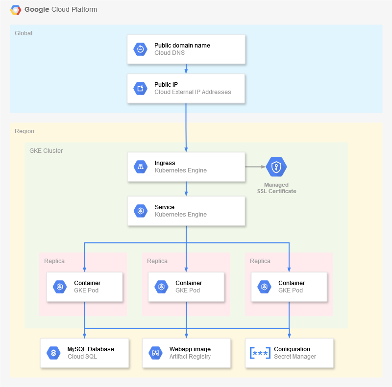

# Terraform for Google Kubernetes Engine Deployment

This example uses [Terraform](https://terraform.io) to provision all resources described in the [Google Kubernetes Engine](../../gcp/gke) guide. See the `main.tf` and `variables.tf` files for more information.

## Prerequisites

A GKE cluster must already exist in the project; if you need to create one you may use the [GKE Cluster](../gke-cluster) Terraform project first.

Before starting, make sure your project includes a firewall rule allowing load balancing health checks to connect to your instances:
```
gcloud compute firewall-rules create allow-google-lb --allow=tcp,icmp --source-ranges=35.191.0.0/16,209.85.152.0/22,209.85.204.0/22,35.191.0.0/16,130.211.0.0/22
```

## Configuration

Create a `terraform.tfvars` file in this directory, providing appropriate values for all variables:

    credentials = "/path/to/credentials.json"
    project_id = "your-project-id"
    region = "europe-west1"
    gke_cluster_name = "karaplan-cluster"
    google_oauth_clientid = "toComplete"
    google_oauth_clientsecret = "toComplete"
    github_oauth_clientid = "toComplete"
    github_oauth_clientsecret = "toComplete"

See `variables.tf` for more information about available variables.
Refer to the deployment [README](../../README.md) file for information about configuring identity providers.

## Execution

Run the following commands:

    terraform init
    terraform plan

If everything looks right, execute the following command to provision all resources:

    terraform apply

After several minutes, the application should become available at the reserved IP address and/or at the custom domain name.

## Architecture diagram


